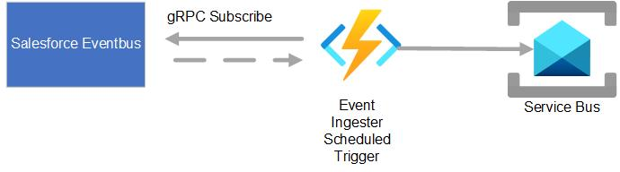

# Caputre Salesforce Events from Salesforce Event Bus
## Introduction  

Salesforce publishes events to Salesforce Event Bus. This example shows how to receive events from Event Bus and push it to Service bus to consume events.

## Prerequistes
* Azure Subscription
* Visual Studio 2022
* .Net Core 6.0
* Salesforce Developer Account
* 
## Architecture
